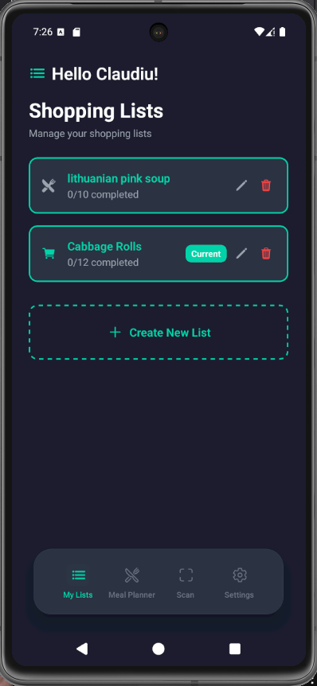

<div align="center">
  
  
  # ScanCartAI
  
  A smart shopping companion app built with React Native and Expo that transforms your grocery shopping experience through AI-powered features.
</div>

## Features

### Smart Shopping Lists
- Create and manage multiple shopping lists
- Edit list names with intuitive interface
- Track completion progress with visual indicators
- Mark items as current or completed

### AI-Powered Meal Planning
- Generate shopping lists from meal descriptions
- Get complete recipes with ingredients and instructions
- Convert meal ideas into organized shopping lists

### Barcode Scanning
- Scan product barcodes to automatically add items
- Access detailed product information via OpenFoodFacts API
- View nutritional information and product details

### List Scanning
- Take photos of handwritten shopping lists
- AI automatically extracts and adds items to digital lists
- Convert physical lists to organized digital format

### Recipe Integration
- Get detailed cooking instructions
- View ingredient lists with measurements
- Cooking time and difficulty indicators

## Screenshots

<div align="center">
  
  
  
</div>

<div align="center">
  
  
  
</div>

<div align="center">
  
  
</div>

## Tech Stack

- **Frontend**: React Native with Expo
- **Navigation**: React Navigation
- **State Management**: Zustand
- **Database**: SQLite (expo-sqlite)
- **Secure Storage**: Expo SecureStore
- **Camera**: Expo Camera
- **AI**: OpenRouter API
- **Product Data**: OpenFoodFacts API

## Prerequisites

- Node.js (version 16 or higher)
- npm or yarn
- Expo CLI
- iOS Simulator or Android Emulator (for testing)

## Installation

1. **Clone the repository**
   ```bash
   git clone https://github.com/ClaudiuJitea/ScanCartAI.git
   cd ScanCartAI
   ```

2. **Install dependencies**
   ```bash
   npm install
   ```

3. **Set up environment variables**
   ```bash
   cp .env.example .env
   ```
   Edit the `.env` file and add your OpenRouter API key:
   ```
   OPENROUTER_API_KEY=your_api_key_here
   ```

4. **Start the development server**
   ```bash
   npx expo start
   ```

5. **Run on device/simulator**
   - Press `i` for iOS simulator
   - Press `a` for Android emulator
   - Scan QR code with Expo Go app on your device

## Configuration

### OpenRouter API Key

To use AI features (meal planning, list scanning), you need an OpenRouter API key:

1. Visit [OpenRouter](https://openrouter.ai/keys)
2. Create an account and generate an API key
3. Add the key to your `.env` file or configure it in the app settings

### App Settings

The app includes a settings screen where you can:
- Set your display name
- Configure OpenRouter API key
- Test AI connectivity
- View app statistics
- Manage notifications

## Project Structure

```
src/
├── components/          # Reusable UI components
│   ├── common/         # Generic components (modals, inputs, buttons)
│   └── shopping/       # Shopping-specific components
├── hooks/              # Custom React hooks
├── navigation/         # Navigation configuration
├── screens/            # Screen components
├── services/           # API and data services
├── types/              # TypeScript type definitions
└── utils/              # Utility functions and constants
```

## Key Components

### Shopping List Management
- **useShoppingList**: Zustand store for state management
- **SQLiteStorageService**: Database operations
- **ShoppingList**: Core data models

### AI Services
- **OpenRouterService**: AI-powered text generation
- **OpenFoodFactsService**: Product information lookup

### Camera Features
- **BarcodeScanner**: Product barcode scanning
- **ListScannerScreen**: Handwritten list recognition

## Database Schema

The app uses SQLite with tables for:
- **lists**: Shopping list metadata
- **items**: Individual shopping items
- **settings**: App configuration

## API Integration

### OpenRouter API
Used for AI features including:
- Meal plan generation
- Recipe creation
- List item extraction from images

### OpenFoodFacts API
Provides product information for scanned barcodes including:
- Product names and descriptions
- Nutritional information
- Images and branding

## Building for Production

### Android
```bash
npx expo build:android
```

### iOS
```bash
npx expo build:ios
```

## Development

### Running Tests
```bash
npm test
```

### Linting
```bash
npm run lint
```

### Type Checking
```bash
npm run typecheck
```

## Contributing

1. Fork the repository
2. Create a feature branch (`git checkout -b feature/amazing-feature`)
3. Commit your changes (`git commit -m 'Add amazing feature'`)
4. Push to the branch (`git push origin feature/amazing-feature`)
5. Open a Pull Request

## Privacy & Security

- API keys are stored securely using Expo SecureStore
- User data remains local to the device
- No personal information is transmitted to external services
- Camera permissions are requested only when needed

## License

This project is open source and available under the [MIT License](LICENSE).

## Support

If you encounter any issues or have questions:
- Check the [Issues](https://github.com/ClaudiuJitea/ScanCartAI/issues) page
- Create a new issue with detailed description
- Include steps to reproduce any bugs

## Acknowledgments

- [OpenFoodFacts](https://openfoodfacts.org/) for product data
- [OpenRouter](https://openrouter.ai/) for AI capabilities
- [Expo](https://expo.dev/) for development platform
- React Native community for excellent documentation